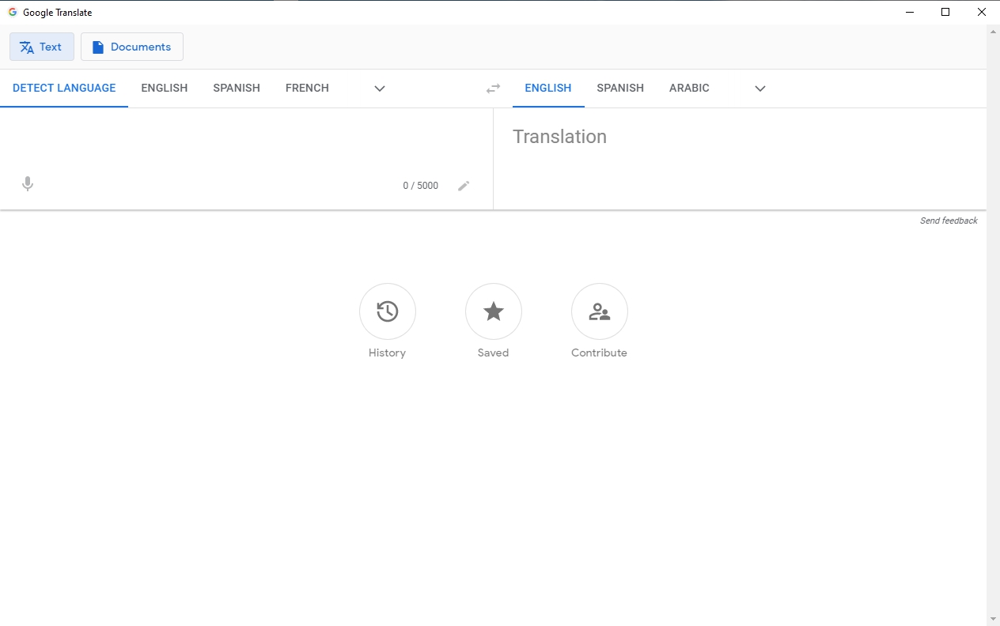

# GTranslate-desktop
Desktop version of Google Translate

This app is made by using nativefier, npm and ElectronJS

If you want to know details about current release you can take a look at our [Change Log](./CHANGELOG.md)



## Installation

```
git clone https://github.com/NativeDesktop/GTranslate.git
npm install
nativefier https://translate.google.com --inject ./resources/styles/custom.css
```
After that you will have two new folders created:

- `node_modules`, and
- `Google Translate-win32-x64`

When you open `Google Translate-win32-x64`, you will find `Google Translate.exe` inside. You should be able to run it directly by double-clicking it.

## Packaging
You can make setup file with Inno-setup script provided.
To execute it, you can use:

```
sh node_modules/.bin/innosetup-compiler resources/scripts/installer.iss
```

Enjoy :smile:

Feel free to contribute.

License: [MIT](./LICENSE)
